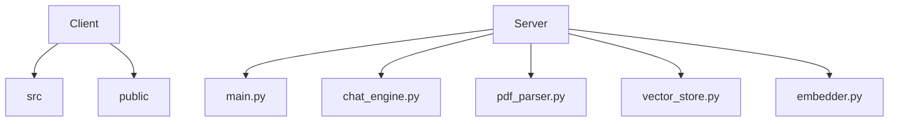
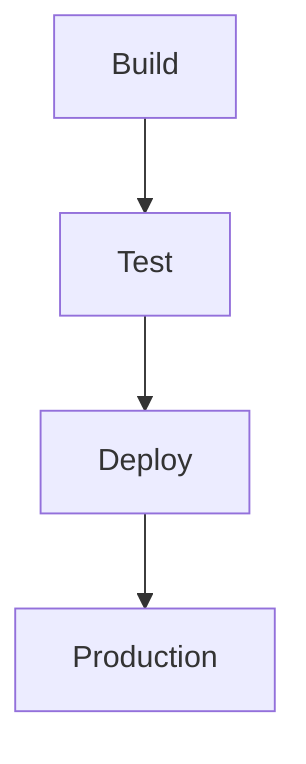

# Quill.ai: AI-Powered PDF Interaction Platform 🤖

## 🗂️ Description

Quill.ai is an innovative platform that enables users to interact with PDF documents using artificial intelligence. The project consists of a client-side React application and a server-side FastAPI application, which work together to provide a seamless experience for uploading PDFs and asking questions about their content. Quill.ai is designed for individuals who need to extract insights from PDF documents, such as researchers, students, and professionals.

The platform uses natural language processing (NLP) and machine learning algorithms to extract text from PDFs, create vector stores, and answer questions based on the content. With Quill.ai, users can upload PDFs, ask questions, and receive accurate answers, making it an ideal tool for those who need to analyze and understand complex documents.

## ✨ Key Features

### 📚 PDF Interaction

* Upload PDFs and extract text using AI-powered PDF parsing
* Create vector stores for efficient querying and retrieval

### 🤔 Question Answering

* Ask questions about PDF content and receive accurate answers
* Utilize RetrievalQA and custom prompts for precise results

### 🌐 Client-Side Application

* Built with React, Vite, and Tailwind CSS for a responsive and modern UI
* Integrates with the server-side application using RESTful APIs

### 🤖 Server-Side Application

* Built with FastAPI, Python, and ChromaDB for efficient processing and storage
* Supports Groq LLM with the Mixtral model for advanced language understanding

## 🗂️ Folder Structure

## 🛠️ Tech Stack

## ⚙️ Setup Instructions

### Prerequisites

* Python 3.11+
* Node.js 16+
* Docker (optional)

### Client-Side Application

1. Clone the repository: `git clone https://github.com/Srilochan7/Quill.ai.git`
2. Navigate to the Client directory: `cd Client`
3. Install dependencies: `npm install`
4. Start the development server: `npm run dev`

### Server-Side Application

1. Navigate to the Server directory: `cd Server`
2. Create a virtual environment: `python -m venv venv`
3. Activate the virtual environment: `source venv/bin/activate` (on Linux/Mac) or `venv\Scripts\activate` (on Windows)
4. Install dependencies: `pip install -r requirements.txt`
5. Start the server: `uvicorn main:app --host 0.0.0.0 --port 8000`

### Docker

1. Build the Docker image: `docker build -t quill-ai .`
2. Run the Docker container: `docker run -p 8000:8000 quill-ai`

## 🤖 GitHub Actions

Quill.ai uses GitHub Actions for continuous integration and deployment. The workflow is defined in the `.github/workflows/main.yml` file and includes the following steps:

* Build and test the client-side application
* Build and test the server-side application
* Deploy the application to a production environment

  

<h3>lochan</h3>

Building whatever.

 

  <a href="https://gitfull.vercel.app">Made by GitFull</a>

    